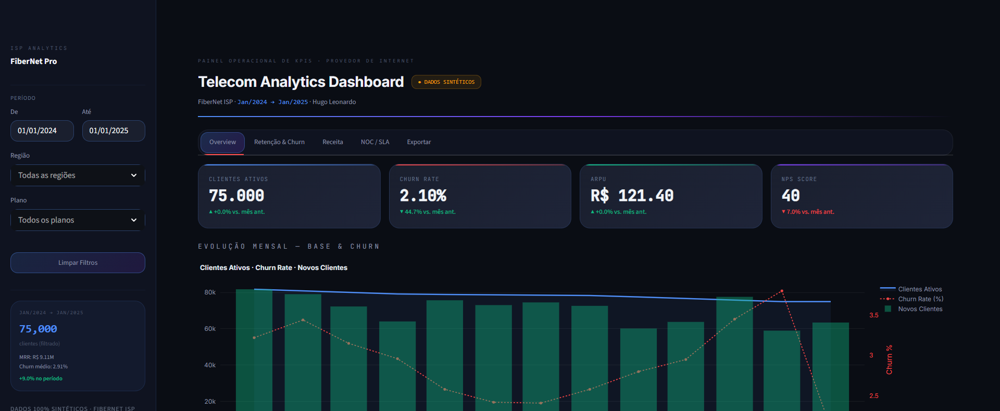
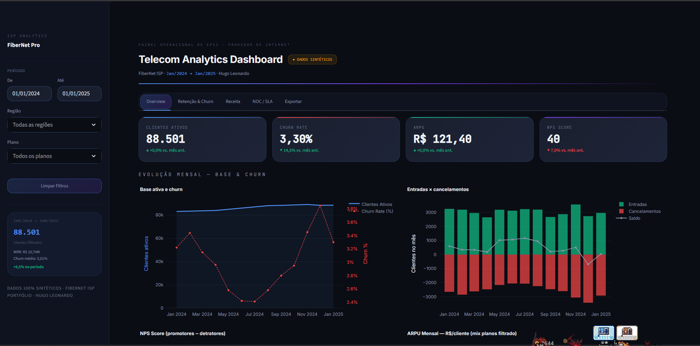
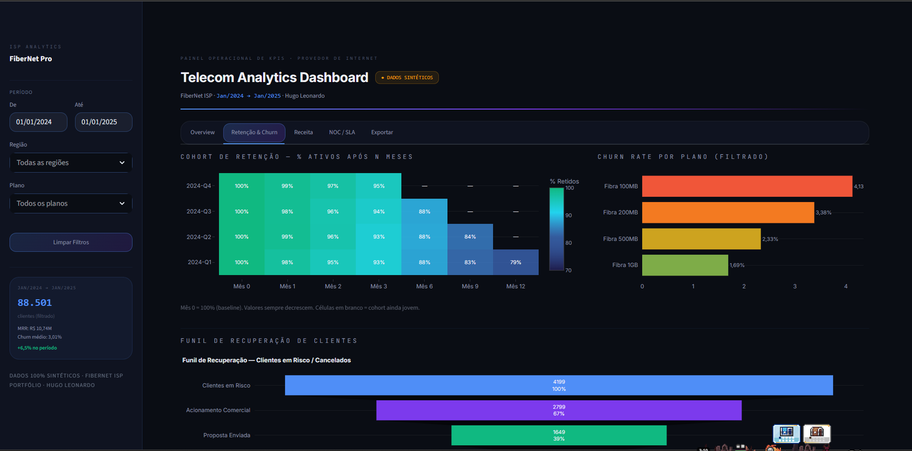
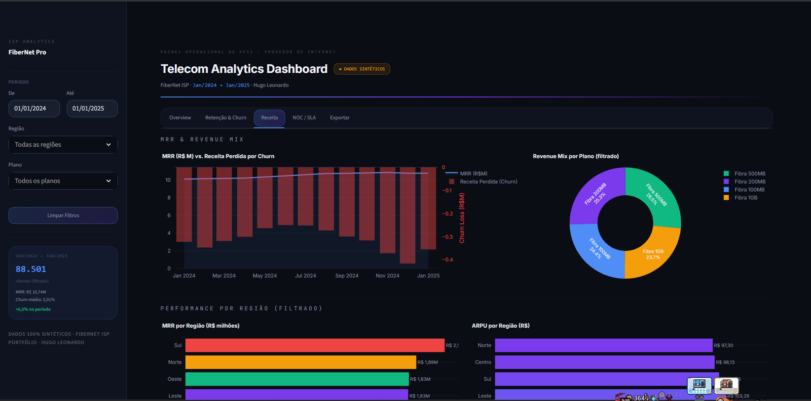
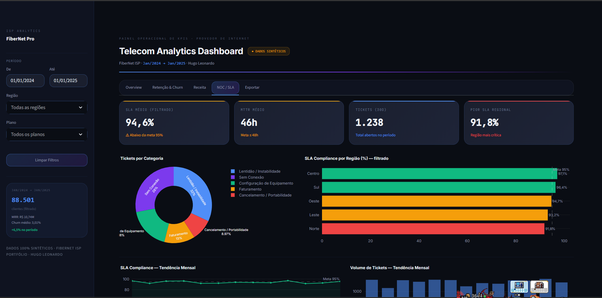
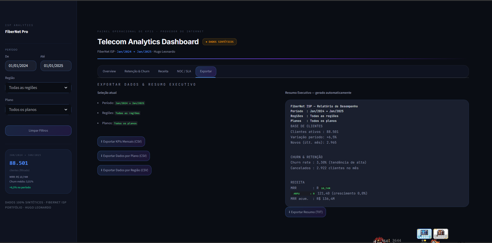

# 📡 Telecom KPI Dashboard — FiberNet ISP

<div align="center">


**Projeto 2 de 4 da série FiberNet Analytics.**  
Dashboard operacional em tempo real com KPIs críticos de ISP — do churn ao SLA — construído para decisão de negócio, não para relatório.

[Como rodar](#como-rodar) · [Ver Série](#-série-fibernet-analytics)

</div>

> Peça do portfólio de **Hugo Nazário**, Analista de Dados — cada projeto, com o contexto de por que foi feito, está em **[hugoleonardonz.github.io/portfolio](https://hugoleonardonz.github.io/portfolio/)**.

---



*Aba Overview: KPIs com variação mês a mês e evolução de base, churn e novos clientes num só gráfico.*

---

## Universo FiberNet — Escala Canônica

Os 3 projetos desta série representam a **mesma empresa fictícia** em granularidades complementares:

| Granularidade | Projetos | Escala | Abrangência |
|---|---|---|---|
| **Amostra Regional** | SQL Analytics Pack | 300 contratos | Centro-MG: Betim, Contagem, Ribeirão das Neves, Esmeraldas, Ibirité |
| **Base de Modelagem** | Churn Predictor | 15.000 contratos | 5 regiões · planos até Empresarial |
| **Visão Operacional Nacional** | Telecom KPI Dashboard | 88.501 clientes (jan/25) | 5 regiões nacionais (Norte, Sul, Leste, Oeste, Centro) |

A divergência de escala é **intencional**: o SQL Pack mergulha numa amostra pequena, onde dá para conferir cada linha na mão. Modelo precisa de volume, então o Churn Predictor gera 15.000 contratos. O KPI Dashboard consolida a operação inteira.

**O que essas bases NÃO são: a mesma tabela.** Cada projeto gera a sua, com o seu gerador. O padrão de negócio se repete — plano de menor ticket cancela mais, atraso e insatisfação antecipam a saída — mas o número exato de um não vale como conferência do outro. O `churn-predictor` chegou a fixar as taxas de churn do app nos valores que a query 02 do SQL Pack devolve, e a coincidência costurada à mão era apresentada como prova de coerência da série.

---

## Contexto de Negócio

Um ISP sem visibilidade operacional centralizada toma decisões no escuro. Este dashboard entrega em uma tela única os KPIs que definem se a operação está crescendo ou contraindo: base de clientes, churn por segmento, ARPU, NPS, receita por região e desempenho de rede (SLA/MTTR).

Construído sobre o universo sintético **FiberNet** — mesmos planos, mesmas regiões e mesma lógica de negócio dos projetos [SQL Analytics Pack](https://github.com/HugoLeonardoNz/SQL-Analytics-Pack) e [Customer Churn Predictor](https://github.com/HugoLeonardoNz/churn-predictor).

---

## Funcionalidades

### 📈 Overview



- Clientes ativos, Churn Rate, ARPU e NPS com delta mês a mês
- Evolução mensal de base, churn e novos clientes (gráfico multi-eixo)
- NPS Score e ARPU com tendência mensal

### 🔁 Retenção & Churn



- **Cohort de Retenção** — heatmap trimestral com decréscimo monotônico garantido (Mês 0 = 100%)
- **Churn Rate por Plano** — correlação inversa entre preço e evasão
- **Funil de Recuperação** — do cliente em risco ao cliente retido

### 💰 Receita



- MRR mensal vs Receita perdida por churn (gráfico combinado)
- Revenue mix por plano (donut chart)
- ARPU e MRR por região

### 🛠️ NOC / SLA



- SLA médio, MTTR médio, volume de tickets e pior SLA regional
- Distribuição de tickets por categoria (Lentidão, Sem Conexão, Faturamento...)
- SLA Compliance por região com meta de 95% marcada
- Tendência mensal de SLA e volume de chamados

### 📤 Exportar



- CSV com KPIs mensais, dados por plano e dados por região
- Resumo executivo gerado automaticamente em TXT

### 🗄️ SQL

Os mesmos dados das abas acima, consultados de verdade — não é dataset paralelo.
Os DataFrames alimentam um SQLite (`src/db.py`) e três consultas usam window
functions reais em vez do equivalente pandas:

- **Variação mês a mês** — `LAG() OVER (ORDER BY month)`, equivalente SQL do
  `.shift(1)` usado no resto do app.
- **Ranking regional por MRR** — `RANK()` + `SUM() OVER ()` para participação e
  participação acumulada.
- **Queda de retenção por coorte** — `LAG()` particionado por coorte
  (`PARTITION BY cohort ORDER BY month`).

A aba mostra a query e o resultado lado a lado. `tools/build_db.py` grava a
mesma base em `data/fibernet_kpi.db`, para abrir num client SQL fora do app.

---

## Filtros Persistentes

Todos os gráficos respondem a:
- **Período** — seletor de datas com validação de intervalo
- **Região** — seleção múltipla (vazio = todas as regiões)
- **Plano** — seleção múltipla (vazio = todos os planos)

Os filtros persistem entre abas dentro da mesma sessão.

---

## Série FiberNet Analytics

Este é o **Projeto 2 de 4** de uma série coesa sobre inteligência de dados em ISP:

| # | Projeto | Foco | Link |
|---|---------|------|------|
| 1 | [SQL Analytics Pack](https://github.com/HugoLeonardoNz/SQL-Analytics-Pack) | SQL analítico · 10 queries · insights brutos | GitHub |
| 2 | **Telecom KPI Dashboard** | BI operacional · visualização em tempo real | **Este repo** |
| 3 | [Customer Churn Predictor](https://github.com/HugoLeonardoNz/churn-predictor) | ML · RandomForest · predição e priorização de risco | GitHub |
| 4 | [CRM Lifecycle Analytics](https://github.com/HugoLeonardoNz/crm-lifecycle-analytics) | Coorte, LTV e teste A/B · medir a ação | GitHub |

A progressão é intencional: identificar o problema (SQL) → monitorar em escala (Dashboard) → prever e agir preventivamente (ML).

---

## Arquitetura de Módulos

```
telecom-kpi-dashboard/
├── app.py              — Entry point: CSS global, sidebar, layout das 6 abas
├── requirements.txt    — Dependências pinadas
├── .gitignore
├── src/
│   ├── __init__.py
│   ├── constants.py    — Constantes globais (COLORS, REGIONS, PLANS, datas)
│   ├── data_loader.py  — Funções @st.cache_data: build_monthly/plans/regions/cohort/support
│   ├── charts.py       — Funções que retornam go.Figure prontas para st.plotly_chart
│   ├── kpis.py         — Helpers de UI: kpi_card(), mini_kpi(), dpct(), compute_filter_scales()
│   └── db.py           — SQLite em memória + consultas com window functions (aba SQL)
├── tools/
│   └── build_db.py     — Grava os mesmos dados em data/fibernet_kpi.db (arquivo real)
└── data/
    ├── README.md       — Documentação dos dados sintéticos e sementes numpy
    └── fibernet_kpi.db — Base SQLite gerada por tools/build_db.py
```

**Fluxo:**  
`app.py` importa de `src/` → chama `build_*()` para obter DataFrames → aplica filtros → chama `make_*()` para obter figuras → renderiza com `st.plotly_chart`.

---

## Como Rodar

```bash
git clone https://github.com/HugoLeonardoNz/telecom-kpi-dashboard.git
cd telecom-kpi-dashboard
pip install -r requirements.txt
streamlit run app.py
```

Acesse em `http://localhost:8501`

### Testes

```bash
pip install -r requirements-dev.txt
pytest tests/ -v
```

14 testes. Os quatro primeiros existem por um defeito concreto: a
quebra por plano e por regiao repartia uma constante escrita a mao (`85_250`)
enquanto a serie mensal terminava em 88.501 clientes. O painel mostrava 88.501 no
cartao de abertura e uma tabela somando 85.249 logo abaixo, e nada quebrava.
Agora as quebras derivam de `base_atual()` e o teste falha se a constante voltar.
Os tres ultimos (`tests/test_sql.py`) cruzam as consultas SQL de `src/db.py`
contra o mesmo numero calculado em pandas — MoM, ranking regional e queda de
retencao por coorte tem que bater nos dois lados, ou um dos dois esta errado.


---

## Stack

`Python` · `Streamlit` · `Plotly` · `Pandas` · `NumPy` · `SQL` (SQLite, window functions)

---

## Autor

**Hugo Nazário**  
Analista de Dados Pleno — SQL · Python · Power BI  
Speed Fibra · Santa Luzia, MG

[](https://www.linkedin.com/in/hugo-leonardo-data-analyst/)
[](https://github.com/HugoLeonardoNz)

---

<div align="center">
<sub>Dados 100% sintéticos gerados para fins de portfólio. Nenhuma informação real de clientes foi utilizada.</sub>
</div>
